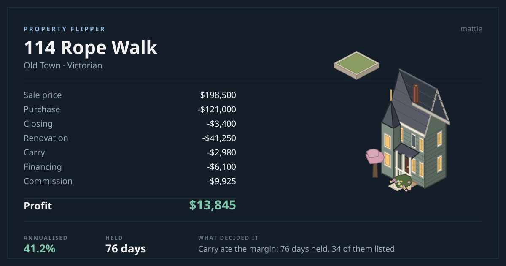

# Property Flipper

**[▶ Play it in your browser](https://ibuilder.github.io/Property-Flipper-Game/)** &nbsp;·&nbsp;
[Download for Windows](https://github.com/ibuilder/Property-Flipper-Game/releases/latest)

A real estate flipping simulation that teaches how flip deals are actually underwritten.

You buy distressed houses, estimate what they will be worth repaired, scope the work, and try to
get out before commission, financing, and carry eat the margin. The numbers are calibrated so that
the industry's own heuristic — the 70% rule — is the right default, and so that ignoring it loses
money.



The town is an isometric board of six neighbourhoods. Every house is drawn from one of ten
archetypes with four condition overlays — a job running, a house let, one derelict, one on the
market — and the lots are shaded by whichever of four questions you are asking: what things cost,
what needs work, where the rivals are, and what is yours. Scout, the site foreman, stands on
whatever job is running.

The same board in the line style, which takes the interface theme and stays out of the way of the
data underneath it:



Every closed deal produces a card you can take away — the cost stack, the profit or the loss, and
what the post-mortem decided was the cause:



This is a ground-up rewrite of [ibuilder/Property-Flipper-Game](https://github.com/ibuilder/Property-Flipper-Game),
which was a Python/Pygame project. See [REWRITE.md](REWRITE.md) for what was wrong with the
original and why the design changed.

---

## Install

Download and run the installer, or use the portable build if you would rather not install:

| File | What it is |
| --- | --- |
| `Property Flipper-2.0.0-Setup.exe` | Windows installer (per-user, choose install directory) |
| `Property Flipper-2.0.0-Portable.exe` | Single-file portable build, no installation |

Saves go to `%APPDATA%\Property Flipper\saves\` and survive uninstalling and reinstalling.

## Play in a browser

```bash
npm run bundle:web
```

Folds the whole game into one self-contained ~2.4 MB HTML file at
`dist-web/property-flipper.html` — no external scripts, styles, or fonts, so it runs anywhere,
including under a strict CSP. Saves go to `localStorage`; file export/import is desktop-only and
the buttons say so.

## Run from source

```bash
npm install
npm run dev
```

That starts Vite, waits for it to come up, then launches Electron. The renderer hot-reloads; edits
to the main or preload process relaunch the window automatically.

To play in a plain browser instead, run `npm run dev:renderer` and open <http://localhost:5173> —
the game works fully in the browser, with saves in `localStorage` rather than on disk. File
export/import is desktop-only and the buttons say so.

## Build

```bash
npm run dist
```

Produces the installer and portable build in `release/`.

Packaging has to rename a directory it just created, and a few locations cannot support that —
folders created straight at a drive root (`C:\Server\`, `C:\Projects\`, …) inherit an ACL granting
`BUILTIN\Users` only `ReadAndExecute`, and electron-builder fails there with
`EPERM: operation not permitted, rename '...win-unpacked.tmp'`. `npm run dist` detects this,
retries under the OS temp directory, and copies the finished artifacts back into `release/`, so it
works either way. Copying into a restricted directory is fine; only the rename is not.

## Test

```bash
npm test
```

491 tests. `tests/engine.test.ts` covers correctness; `rental`, `auction`, `financing`,
`progression` and `arcs` each cover their own subsystem; `tests/store.test.ts` pins the multi-day
skip behaviour; and `tests/balance.test.ts` runs a rules-following bot through complete campaigns
across 100 seeds to check the economics are both winnable and punishing. Balance results are written
to `balance-output.txt`.

`tests/art.test.ts` and `tests/ui-art.test.ts` check the commissioned art against what the code
asks for by *name* rather than by count — the check that would have caught three archetypes being
drawn that the engine never generates while three it does generate had no art at all. The contact
sheets in `docs/design/` and the board images above are written by the test run, so a picture in
this README that disagrees with the game is a failing build rather than a stale file.

```bash
npm run audit
```

Launches the real renderer in Electron at 1280×800 — the size the store embed uses, not the wider
one the shell was designed at — walks nine screens, and fails the build on any of six things: text
under AA contrast, a control that misses the WCAG 2.2 target-size minimum, a scroll container that
scrolls by less than its own scrollbar, two controls drawn on top of each other, content spilling
out of a height it was given, or content sitting above the top of a scroll container where nothing
can reach it. A screen it cannot reach is a hard failure rather than a quiet skip.

The last four came from photographing the game for its store page and looking at the results: the
top bar's controls wrapped at 1280 and the wrapped line was painted through the tab strip, and the
main menu centred itself inside its own scrollbar so its title was 180px above the top of the
screen with nowhere to scroll to.

```bash
npm run shots
```

Walks the same nine screens and photographs each one at 1280×800 into `docs/shots/`. The scene list
is shared with the audit — reaching those screens is the fiddly part — and `Math.random` is pinned,
so the same town, the same houses and the same numbers come out every run. These are the store
screenshots; making them by hand means they are wrong the first time anything moves and nobody
notices.

To check the packaged desktop app actually starts:

```bash
npm run build && npm run smoke
```

That launches Electron against the production build and asserts the renderer mounts. CI runs it on
Windows, macOS and Linux on every push, which is what makes "it builds" mean "it runs" on the two
platforms not being developed on. See [RELEASING.md](RELEASING.md) for the release and code-signing
pipeline.

---

## How the game works

### Learn mode

Five lessons, each isolating one way a flip goes wrong — the 70% rule, why the inspection pays, how
comps mislead, what carry costs, and what leverage actually rents you. Each is a single authored
deal with its own clock and pass mark, and the lesson text is shown on completion whether you passed
or not.

You can also **author a deal and share it as a code**. The code carries the whole scenario — house,
which defects exist and which are disclosed, seller type, market conditions, starting cash, target
profit — so an instructor can set a specific problem and hand it out with nothing hosted anywhere.
That is the thing a spreadsheet cannot do, and it is why the research put this ahead of progression
features.

### The loop

1. **Screen the market.** Every listing shows an asking price and your estimate of as-is value.
   Those are different numbers, and the gap is not the deal — it is the starting point.
2. **Inspect before you offer.** A standard inspection finds ~60% of defects, thorough ~90%.
   Findings are disclosed to the seller, who has to concede most of the repair cost or lose the
   deal. This is the only mechanism that lets you renegotiate, and it is why inspection pays.
3. **Scope the work.** Pick line items. The Deal Analyzer re-prices live as you add them.
4. **Run the numbers.** Two max-offer figures sit side by side: the 70% rule and an itemised cost
   stack. When they disagree, the itemised one is right, and the app tells you why.
5. **Offer.** The seller has a hidden reserve. Rejected offers cost nothing but a day, and listings
   that sit get cheaper.
6. **Renovate.** Hidden defects surface as change orders against your contingency. When the
   contingency runs out, they come straight out of cash.
7. **Sell.** List price drives buyer traffic sharply — overpricing does not cost you a little time,
   it costs you months of carry. Any defect you left unrepaired comes back as a buyer concession at
   1.15× what the repair would have cost.
8. **Or buy at the courthouse.** Trustee sales sit on their own board. The opening bid is what the
   lender is owed rather than what the house is worth, so the discount is real — but you cannot
   inspect, cannot finance, and about a third of lots still have somebody living in them. Bidding is
   by proxy: name a maximum and pay one increment over the underbidder.
9. **Or keep it.** Put a tenant in instead, then refinance and pull your capital back out to buy the
   next one — buy, rehab, rent, refinance, repeat. The lender sizes that loan by the *lesser* of 75%
   of value and what the rent covers at 1.20× debt service, so a house bought at retail will not
   refinance however much equity it has. That constraint is the reason BRRRR insists on buying below
   value, and the panel tells you which of the two caps is binding.

### What it models that the original did not

The original had no closing costs, no financing, no carry, and no commission, and you bought and
sold at the same computed value. That makes "buy, renovate, sell" look free. It is not:

| Cost | Rate |
| --- | --- |
| Buy-side closing | 2% of purchase |
| Hard money points | 2% of principal, deducted from the wire |
| Hard money interest | prevailing rate + 4.5%, interest-only, 365-day balloon |
| Property tax | 0.9%–1.7%/yr by neighborhood |
| Vacant insurance | 0.7%/yr |
| Utilities / HOA | $210/mo, plus HOA where applicable |
| Agent commission | 6% of sale |
| Seller closing | 1% of sale |
| Buyer concession | 1.15× the repair cost of anything you left broken |

Together these consume most of the 30% haircut the 70% rule reserves — which is exactly what the
rule is standing in for.

### Difficulty

Measured by a bot that applies the 70% rule, inspects before offering, and reserves 15% contingency,
across 30 seeds:

| Campaign | Bot win rate | Avg deals |
| --- | --- | --- |
| The First Flip | 77% | 1.9 |
| Working With Leverage | 50% | 4.8 |
| Portfolio Builder | 75% | 9.7 |

The same bot set to pay 92% of ARV with no inspection and no contingency wins 47% of tutorial runs
and ends with **$154,486** net worth against the disciplined bot's **$278,829**. Skipping the
inspection is the cheaper-looking mistake and still costs about $59,000.

The tutorial is measured over 30 seeds; the longer campaigns over 20. Ten was not enough — a
two-campaign difference read as a twenty-point swing in win rate, which is enough to make sampling
error look like a balance regression.

---

## Architecture

```
src/engine/     Pure TypeScript simulation. No DOM, no React, fully unit-tested.
  rng.ts          Seeded, serialisable PRNG — every run is reproducible
  types.ts        Domain model
  content.ts      Neighborhoods, archetypes, scope catalogue, defects, events, levels
  valuation.ts    Value model, ARV, appraisal noise, comps
  finance.ts      Closing costs, hard money, carry, amortisation, refinance sizing, net worth
  renovation.ts   Scope quoting, scheduling, change orders
  rental.ts       Market rent, NOI, cap rate, cash-on-cash, DSCR, tenants
  auction.ts      Trustee sales: credit bids, proxy bidding, occupied lots
  market.ts       Property generation, seller reserve, buyer offers
  analyzer.ts     The 70% rule and the itemised cost stack
  events.ts       Market cycle modifiers
  game.ts         State machine and the day loop
  save.ts         Versioned saves with migrations

src/ui/         React renderer. Reads the engine, never reimplements it.
  components/     Modal, ScopeBuilder, DealAnalyzer, PropertyFacts, Art, DealCardModal
  views/          Market, Portfolio, Finance, Skills, Track record, Help, Saves
  board/          The isometric town
    projection.ts   The one copy of the isometric maths
    art.ts          Placing commissioned drawings on the grid
    backdrop.ts     The rest of the town: scenery on lots the game does not model
    legibility.ts   Sizing the board against the device it is drawn on
  coach/          Scout: the rules table, and what he is looking at
  dealCard.ts     A closed deal as a shareable picture

art/            The commissioned drawings, as delivered, plus their generators.
                `npm run art` compiles them into the bundle. Never edited by hand.
electron/       Main process and preload. The only filesystem access in the app.
scripts/        Build, dev launcher, packaging, icon and cover, art ingest, audit.
tests/          Correctness suite, skip-behaviour tests, the balance harness, and
                the art checks that compare drawings against what the code names.
```

Two design decisions worth knowing about:

**The engine mutates state in place.** Deep-cloning a 900-day game state every tick is wasteful, so
the store bumps a version counter and React subscribes to that. Use `useVersion()` in `useMemo`
dependencies — `gameState.version` is the *save format* version and never changes during play.

**Every cash movement goes through one function.** `applyCash()` in `game.ts` is the sole writer of
`state.cash`, and it appends to the ledger. That is what makes the per-deal P&L trustworthy; a test
asserts the ledger always sums to the cash balance.

## Security

The renderer runs with `contextIsolation: true` and `nodeIntegration: false`. All file access goes
through a narrow preload bridge (`electron/preload.ts`) that exposes only save/load operations —
no `fs`, no `path`, no `ipcRenderer`. Save slot names are sanitised against path traversal, the
window blocks navigation, and a CSP restricts the page to same-origin resources.

## Keyboard

| Key | Action |
| --- | --- |
| `N` | Advance one day |
| `W` | Advance a week |
| `M` | Advance a month |
| `1`–`5` | Switch tab |
| `S` | Saved games |
| `H` or `?` | How to play |
| `Esc` | Close a dialog |

Shortcuts are suppressed while a dialog is open or a field has focus, so an offer price never gets
eaten by the day-advance key. Table rows are real controls — focusable, and activated with Enter or
Space.

## License

MIT, same as the original project.
