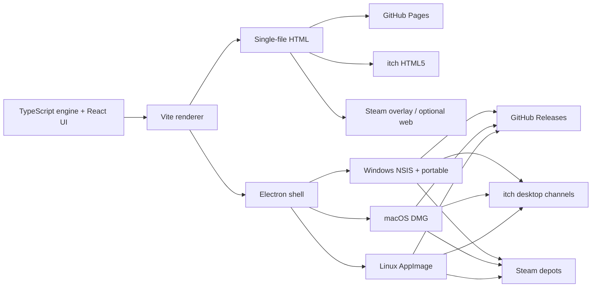

# Plan: upgrade, ship everywhere that fits, and test

Written after reading the running tree (v2.2.0), not from the older roadmap
memory. `ROADMAP.md` Phases 1–5 are **already in the product**. This document
is the next sequence: remaining product work, storefronts, and the tests that
must pass before each one.

---

## 1. What the game is now

Property Flipper is a **deal-underwriting sim**, not a renovation toy. You
screen listings, inspect, scope, finance, carry, and sell (or rent and
refinance). The 70% rule and an itemised cost stack sit side by side; when they
disagree the itemised figure is the one that is right.

| Layer | What is actually there |
| --- | --- |
| Engine | Pure TypeScript in `src/engine/`. Seeded RNG, one cash writer (`applyCash`), versioned saves. Offer/reserve, noisy ARV, inspections, line-item rehab, change orders, auctions, five financing instruments, BRRRR, rivals, neighbourhood arcs, event chains, four campaigns × three difficulties. |
| Teaching | Five authored lessons, scenario codes an instructor can share with nothing hosted, Scout as a rules-table coach, post-mortems, shareable deal cards, inline formulae. |
| Presentation | Isometric town from commissioned art (ten archetypes, seasonal sets), Industry design system, dark-first with a real light theme. |
| Verification | Vitest suite (engine, balance, art-by-name, theme, board, marketing codecs). Electron smoke on Windows, macOS and Linux every push. Accessibility audit of the real renderer at 1280×800. Screenshot and GIF capture with pinned RNG. |
| Distribution already wired | GitHub Pages demo. GitHub Releases: Windows NSIS + portable, macOS DMG, Linux AppImage. itch.io butler push of HTML5 + those four desktop channels. Signing and notarisation switch on when secrets exist. |

The original Pygame game did not run and could not teach flipping. This rewrite
already is the upgrade of *that*. A second rewrite into Unity/Unreal, 3D
renovation, multiplayer, or GPS-linked listings is explicitly out of scope
(`ROADMAP.md` §6). Native phone stores are also a poor fit: the game is dense
tables and a 1280×800 two-column layout. Phone-playable via the browser is the
honest mobile target; wrapping Electron in Capacitor would ship a worse UI at
store-review cost.

**The binding constraint is no longer features.** It is credentials, storefront
accounts, human playtests, and a handful of product decisions that move
balance.

---

## 2. Platform map — ship these, skip those

“All platforms” for this codebase means **every place a self-contained HTML
file or an Electron binary already belongs**, plus Steam. It does not mean
rebuilding the sim as a native iOS/Android app.

| Destination | Status | What is left |
| --- | --- | --- |
| GitHub Pages | Live | Keep CI green. Confirm OG card still unfurls. |
| itch.io HTML5 + Win/Mac/Linux | Pipeline exists | `ITCH_API_KEY`, `ITCH_USER`, `ITCH_GAME`. Project kind **HTML**, embed **1280×800**. Confirm butler channels (`html5`, `windows`, `windows-portable`, `mac`, `linux`) all hold the same version. |
| GitHub Releases | Wired on `v*` tags | Buy signing identities so Windows is not SmartScreen-blocked and macOS is not Gatekeeper-blocked. |
| Steam | Not started | Partner account, app ID, depots per OS, store capsule from existing marketing cuts, build upload from the same release artifacts. No Steamworks API required for v1 (offline, no achievements). |
| Microsoft Store | Optional later | `appx` target in electron-builder after Windows signing exists. Different identity than GitHub/itch. |
| Mac App Store | Skip for now | Needs a Mac App Store cert (not Developer ID), sandbox, and a different notarisation path. `RELEASING.md` already warns those certs will not work for DMG distribution. |
| Flathub / `.deb` / Snap | Skip for v1 | AppImage is the Linux artifact CI already smoke-tests. Extra formats are packaging work with no new players until Flathub review. |
| Google Play / App Store | Skip | Not this UI. Browser + “Add to Home Screen” is the mobile path. |
| Windows ARM / Linux ARM | Later | Current targets are x64. Add arch only after x64 storefronts are signed and selling. |

**Do first:** close itch + signed GitHub Releases (the pipeline is written).
**Do second:** Steam, using the same binaries.
**Do not:** a native mobile client, MAS, or a game-engine port.

---

## 3. Workstreams, in order

Each stream is independently shippable. Do not start Steam packaging before
itch is actually receiving the current tag.

### Stream A — Finish the stores that are already wired

Account and identity work. Almost no code.

1. Create/confirm the itch project as **HTML**, paste `docs/itch-page.md`, set
   embed 1280×800, fullscreen on, mobile-friendly on (with the known caveat:
   the market table still scrolls sideways on a phone).
2. Set repository secret `ITCH_API_KEY` and variables `ITCH_USER` / `ITCH_GAME`.
3. Dispatch “Publish to itch.io” once and read butler status: four desktop
   artifacts plus HTML5, same userversion.
4. Buy a Windows OV (or EV) code-signing certificate and Apple Developer
   Program membership. Put the secrets named in `RELEASING.md` in the repo.
   Cut a tag and confirm CI reports **signed + timestamped** Windows and
   **signed + notarised** macOS.
5. Until those certs exist, keep shipping unsigned — it works; it is a bad
   first impression, not a broken build.

**Test gate:** `workflow_dispatch` itch publish succeeds; release job
summaries say signed/notarised when secrets are present; a fresh Windows VM
and a Mac that has never seen the app can launch without a developer
workaround (or, while unsigned, the documented right-click Open path).

### Stream B — Steam (the missing “real” store)

Code changes are thin: a Steam depot layout and a store checklist, not a
Steamworks feature set. The game is offline and has no accounts.

1. Register the Steamworks app. Capsules: reuse `npm run marketing` outputs
   plus `docs/shots/` (already 1280×800, RNG-pinned). Add a 616×353 header and
   a 374×448 library capsule as extra cuts in `scripts/marketing-assets.mjs`
   if Steam’s current sizes are not already covered.
2. Upload the same three OS artifacts the release workflow already builds.
   Prefer unpacked / Portable / mac zip / AppImage in the Steam depot — not the
   NSIS installer or a DMG. `npm run steam:package` does that ordering.
3. Store page copy can start from `docs/itch-page.md`. Do not use the Flip
   Empire mockups (`docs/marketing/README.md` explains why).
4. Trailer: 2–3 minutes. Hook already decided in the roadmap: analyzer with
   the two maximums disagreeing, then a flip going wrong and the deal card
   naming why. `npm run clips` GIFs are for forums, not for Steam’s trailer
   slot.
5. Optional later: Steam Cloud for saves (today: `%APPDATA%` / userData /
   `localStorage`). Do not block launch on it.

**Test gate:** install via Steam on Win/macOS/Linux, complete the tutorial
deal, quit, relaunch, save still there. Steam Deck: big-picture mode with
mouse emulation; record whether the 1280-wide layout is usable at 1280×800
and at 800×1280. If Deck is unusable, mark unsupported rather than shipping a
lie.

### Stream C — Product upgrades that are still worth building

Not a new simulation. Presentation and teaching holes that are already named.

| Item | Why it is next | Risk |
| --- | --- | --- |
| **Renovation before/after, on the job screen** | **Done.** `JobBeforeAfter` on the running job, using `boughtAs` vs the live facade (WIP does not move value). |
| **`kitchen` and `bath` icons** | **Done.** Scope headings mark all eight categories. |
| **Instructor / class board** | **Done, local.** Concept CSV copy, Scout lock on the save (v17), assessment checkbox when starting a lesson. No hosted section board — nothing is hosted. |
| **Press kit generator** | **Done.** `npm run presskit`. Steam capsules from `npm run marketing`. `npm run steam:package` stages release artifacts. |
| **PWA / Add to Home Screen** | **Done.** `public/manifest.webmanifest` — the honest mobile path, not a native store client. |
| **Barlow / Barlow Condensed** | Still open. Bundling costs tens of KB in the single-file build. |

**Deliberately later, because they move every campaign:**

- **Make the 70% rule sometimes generous.** Across 1,260 listings, `mao70 >
  maoDetailed` never happens, so the analyzer’s “rule of thumb is too
  generous” branch and the offer meter’s amber state are unreachable. Fixing
  that needs content with expensive carry (slow neighbourhood, long schedule,
  or high rates) — a balance change, not a UI tweak (`ROADMAP.md` G-0).
- **Make liquidity bind.** Measured: zero unaffordable jobs across eight
  campaigns. A lender reserve was tried twice on Brutal and blocked nothing.
  Binding cash means lower starting cash or rehab paid in draws — it moves
  Standard and the harness together. Owner call; do not sneak it into a
  graphics PR (`docs/playthrough-findings.md`).

**Do not build:** 3D renovation, multiplayer, real listing data, dusk/night
palette (drawn, no mechanic), eleventh archetype (widens listing variance and
shrinks the discipline gap).

### Stream D — Human playtesting (the one thing the repo cannot do)

`docs/playtesting.md` is the protocol. Run it before any balance change.

1. Session 1: stranger, The First Flip, browser, think aloud.
2. Session 2: someone who actually underwrites, Portfolio Builder.
3. Session 3: session-1 player a week later, unsupervised.

Collect **Saves → Copy session report**. Act only on bounce-before-first-offer,
expert-called-a-number-wrong, the same mistake twice, or a subsystem nobody
finds. Re-run `npm test && cat balance-output.txt` before retuning anything.

---

## 4. Test plan

Three layers. Automate what a bot can see; pay people for the rest.

### 4.1 Already running — do not regress these

| Command | What it proves | Where |
| --- | --- | --- |
| `npm run typecheck` | Types | CI every push |
| `npm test` | Engine correctness, save migrations, art ids vs `content.ts`, theme contrast tokens, board/backdrop invariants, GIF/PNG codecs, balance harness | CI every push; balance table in the job summary |
| `npm run build && npm run smoke` | Packaged app starts; renderer mounts | CI on Ubuntu, Windows, macOS every push |
| `npm run audit` | Real renderer at 1280×800: AA contrast, 24px targets, no overlap, no spill, no unreachable scroll | Linux CI |
| `npm run bundle:web` | Single-file HTML builds | Linux CI + itch job |
| `npm run shots` / `npm run clips` | Store images and GIFs match the running game | Manual / when UI moves |

Before any storefront upload: tag a release so the Release workflow has
already smoke-tested the **same** binaries you upload.

### 4.2 Add when Stream A/B land

| Gap | Test to add |
| --- | --- |
| itch channels can silently hold mixed versions | **Done.** `npm run itch:status -- --expect vX.Y.Z --require` after butler push; the itch workflow retries and fails the job if a channel is still on another tag. |
| Steam install ≠ GitHub artifact | Package from `gh release download` of the tag. `steam-package` prefers unpacked/portable/zip/AppImage and warns on Setup.exe / DMG. One install-from-Steam smoke per OS remains owner-side. |
| Unsigned vs signed confusion | Release summary already prints the signed/unsigned sentence; keep it. After certs: Windows `Get-AuthenticodeSignature` Status `Valid` + timestamp; macOS `spctl --assess` (already in `release.yml`). |
| Layout at store sizes | Extend `scripts/scenes.js` / audit to **960×540** (itch recommended embed), **1280×800** (current), and **375×812** (phone). Phone is allowed to single-column; it is not allowed to clip primary actions. |
| Steam Deck | Manual: tutorial deal + save round-trip. Record pass/fail; do not claim Deck support without a pass. |

### 4.3 Product-change tests (Stream C)

Every UI change that reads engine numbers must assert **the engine number,
not a restated one** (deal cards already do this). Before/after on the
renovation screen: the two facades are the same property at two scope
states, not two different houses. Class board: a scenario code round-trips
and a coach-lock save cannot fire Scout. New marketing sizes: extend
`tests/marketing-assets.test.ts`.

Balance: if Stream C stays presentation-only, the 100-seed harness table
must be byte-identical. If G-0 or liquidity work is approved, **re-baseline
deliberately** and write the new table into `docs/playtesting.md` in the same
PR.

### 4.4 Manual matrix (each release candidate)

| Surface | Do this |
| --- | --- |
| Pages demo | Cold load, first flip, lesson 1, scenario paste. |
| itch HTML embed | Play inside the iframe at 1280×800 and fullscreen. |
| Windows Setup.exe | Install to a non-default dir, play, uninstall, confirm `%APPDATA%\Property Flipper\saves\` survived. |
| Windows Portable.exe | Run from a folder with a space in the path. |
| macOS DMG | Drag to Applications, first launch (Gatekeeper or notarised). |
| Linux AppImage | `chmod +x`, launch from a file manager, confirm `.desktop` name/icon if installed. |
| Browser phone | First Flip on a ~375px-wide viewport; confirm tour + offer still reachable. |
| Light and dark | One full flip in each theme (audit covers contrast; this covers “can you finish”). |

---

## 5. Suggested sequence of PRs

1. **This plan** (docs only) — done.
2. **Marketing size cuts Steam still needs** + press-kit folder script — **done in this branch**.
3. **Renovation before/after** — **done**.
4. **Instructor tools** (CSV + coach lock) — **done**.
5. **Steam packaging** (`npm run steam:package`, `docs/steam.md`) — **done**. Upload still needs a partner account.
6. **Balance PRs** only after Stream D sessions, and only with a harness
   re-baseline.

Owner-only, not PRs: itch secrets, signing certs, Steamworks app, trailer
file, recruiting the three playtesters.

---

## 6. What this plan is not

It is not a schedule. It is not a commitment to native mobile, Steam
achievements, or making cash scarce. Those need an explicit yes because they
change the product or the store listing in ways that are expensive to undo.

The simulation is already the differentiator. Shipping it where people already
look for indie sims, with signatures that do not scare them off, and watching
three humans play, is the upgrade that is left.
